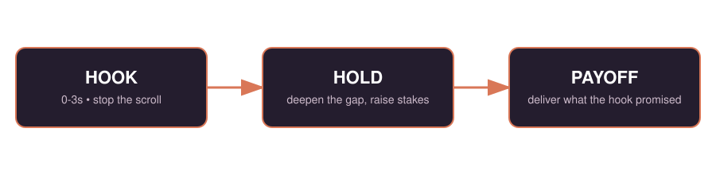

<div align="center">


# Unslop

**Rewrite AI-sounding social content, or write it from scratch, into authentic, platform-native posts.**

[](./LICENSE)
[](https://github.com/anthropics/skills)
[](./CONTRIBUTING.md)
[]()

</div>

## The problem

Most AI-generated social content sounds the same. Sentences run the same
length. "Unlock," "revolutionize," and "testament to" show up whether or not
they mean anything. The hook doesn't hook. Nothing in it is specific enough
to actually be about anything. That's not an accident — it reads like it was
written for no one in particular, because it was.

Unslop is a [Claude Skill](https://github.com/anthropics/skills) that takes
that draft, works out exactly which patterns are making it generic, and
rebuilds it around a real hook-hold-payoff structure tuned to how the target
platform actually keeps or loses attention.

## What makes this different

This isn't an AI-detector-evasion tool. Detectors change constantly and have
high false-positive rates on non-native English and technical writing, so
building around beating them is a losing bet, and a slightly dishonest one.

Unslop works from the psychology instead: curiosity gaps (Loewenstein), the
Zeigarnik effect, emotional arousal and sharing (STEPPS), and hard
platform-retention data — TikTok's first-second attention gate, LinkedIn's
85% muted-viewing rate, Instagram's "caption valley." It also won't invent a
stat, credential, or personal story to make a hook land harder. See
[Guardrails](./SKILL.md#guardrails).

## Install

**Claude Code (recommended)**
```bash
git clone https://github.com/nishchay-bhudia/unslop.git
mkdir -p ~/.claude/skills
cp -r unslop/. ~/.claude/skills/unslop/
```
Restart Claude Code, or start a new session. The skill triggers on its own
when you paste content that sounds AI-generated, or when you say something
like "humanize this" or "unslop this."

**Project-level** (skill applies only inside one project)
```bash
mkdir -p .claude/skills
cp -r unslop/. .claude/skills/unslop/
```

**Claude.ai**
1. Download this repo as a ZIP (Code → Download ZIP), or clone it and zip the
   `unslop/` folder yourself.
2. Go to Settings → Customize → Skills → Upload skill.
3. Upload the ZIP.

## Quick start

Paste a script, caption, or post that sounds robotic, vague, or written by
ChatGPT. Say which platform it's for — TikTok, Reels, Shorts, X, LinkedIn, or
Facebook — or leave it out. If the platform, the tone, or a real detail the
hook needs is genuinely missing, Claude asks first — as multiple-choice
questions with real options and a way to type past them, not an open-ended
paragraph to figure out on your own.

Once that's settled, you get exactly two things back: the rewritten post,
and a short list of what it does better, each line pointing at the specific
phrase that earns it. No diagnosis essay, no score, no filler.

```
> Unslop this for TikTok:
> "Today I want to discuss the transformative impact of consistency in
> content creation. Many creators struggle with this..."
```

Nothing written yet? Unslop also builds from scratch. Give it an idea, a few
bullet points, or a rough brief instead of a draft, and it runs the same
hook-hold-payoff logic to write the post rather than edit one:

```
> Write me a LinkedIn post from scratch: I shipped a Claude Skill last
> weekend, went from 0 to 40 stars in 3 days, the thing that actually worked
> was posting the failed first version, not the polished one.
```

If a real detail is missing — a number, a name, a moment — it asks for one
instead of making it up. See [Guardrails](./SKILL.md#guardrails).

Six full before/after transformations, one per platform, plus a
generate-from-scratch walkthrough, live in [`examples/`](./examples).

## Features

**A 6-stage pipeline, not a single rewrite pass.** Diagnose, extract,
reconstruct, humanize, platform-adapt, quality-control. Full detail in
[`SKILL.md`](./SKILL.md).

**Rewrites an existing draft or writes one from nothing.** Same hook and
platform logic either way — see [Mode Detection](./SKILL.md#mode-detection).

**38 hook formulas**, organized by audience awareness and psychological
lever, each with a real example and, where it exists, measured performance
data — [`references/hook-formulas.md`](./references/hook-formulas.md).

**Built on research, not a detector.** Curiosity gap theory, the Zeigarnik
effect, STEPPS — [`references/psychology.md`](./references/psychology.md).

**A 23-point AI-tell checklist** with a fix for each pattern —
[`references/ai-patterns.md`](./references/ai-patterns.md).

**Platform-native pacing** for TikTok, Reels, Shorts, X, LinkedIn, and
Facebook, down to exact caption cutoffs — Instagram's ~125-character
truncation, LinkedIn's ~210-character mobile cutoff, Facebook's FLAME
framework — in [`references/platform-rules.md`](./references/platform-rules.md).

**Won't fabricate.** No invented stats, credentials, or personal experience,
even when it would make the hook land harder.

**A 23-case test suite** for checking any change to the skill against real
scenarios — [`test-suite/test-cases.md`](./test-suite/test-cases.md).

Open-source, MIT-licensed. No paywall, no usage limit.

## How it works



| Stage | What happens |
|---|---|
| 1. Diagnose | Scans for AI tells: uniform rhythm, hedging, filler transitions, generic vocabulary. |
| 2. Extract | Isolates the real core message, strongest claim, and audience — before touching any wording. |
| 3. Reconstruct | Picks a hook formula by audience awareness, builds a hook → hold → payoff arc. |
| 4. Humanize | Varies rhythm, replaces inflated vocabulary, adds specificity, cuts hedging. |
| 5. Platform adapt | Reformats for the target platform's actual pacing, caption, and CTA rules. |
| 6. Quality control | Re-checks against the Stage 1 diagnosis before returning anything. |

## Platform rules at a glance

| Platform | Hook window | Length | Must-have |
|---|---|---|---|
| TikTok | 0.7-3 seconds | ≤ 60s, 100-150 char caption | text overlay synced to spoken hook |
| Instagram Reels | ~2 seconds | 15-90s; caption survives ~125-char cutoff | save/share-focused CTA, avoid the 60-120 char "caption valley" |
| YouTube Shorts | ~5 seconds | 30-60s | SEO-keyword title, not a hook |
| X / Twitter | first 10 words | 15-30s or thread | each thread tweet stands alone |
| LinkedIn | ~210 char mobile cutoff | 45-90s video or 800-1,200 char post | mandatory on-screen captions (85% watch muted) |
| Facebook | opening fact/detail | 40-250 chars (40-80 optimal) | FLAME structure, genuine closing question |

Full detail and rationale: [`references/platform-rules.md`](./references/platform-rules.md).

## Example: TikTok before/after

Before (AI-generated):
> "Today I want to talk about the transformative impact of building in
> public. In summary, sharing your progress is important because it can
> unlock valuable feedback."

After:
> **Hook:** "I posted my failed side project publicly for 90 days straight.
> Here's what actually happened."
> **Hold:** "Not the highlight reel — the actual screenshots, including the
> week I got zero engagement."
> **Payoff preview:** "One post at day 61 changed everything, and it wasn't
> the one I expected."

Five more full transformations (Reels, Shorts, X, LinkedIn, Facebook) live in
[`examples/`](./examples).

## Why this matters, with the data

This isn't a rewrite based on vibes. A few measured findings this skill is
built around:

Roughly half of people can correctly identify AI-generated copy on sight, and
engagement measurably drops, around 12%, the moment content reads as
AI-generated to the person seeing it.

In head-to-head comparisons, human-written content has driven several times
more traffic and click-through rate than AI-generated content, with
noticeably longer session duration on the human-written side.

The best-performing content mix isn't all-human or all-AI. A rough
70% AI-assisted / 20% human-written / 10% real-time split has outperformed
both pure extremes in measured testing.

On Instagram specifically, the "safe middle" caption length — 60 to 120
characters, the range most advice defaults to — is the worst-performing
length on the platform. Short wins, and so does a full Hook-Value-CTA
caption. The middle loses.

Full sourcing and case studies: [`references/human-vs-ai-data.md`](./references/human-vs-ai-data.md).

## Documentation

- [`SKILL.md`](./SKILL.md) — the full, executable skill definition.
- [`references/hook-formulas.md`](./references/hook-formulas.md) — all 38 hook formulas.
- [`references/platform-rules.md`](./references/platform-rules.md) — platform pacing and caption rules.
- [`references/ai-patterns.md`](./references/ai-patterns.md) — the 23-point AI-tell checklist.
- [`references/psychology.md`](./references/psychology.md) — the research this skill is built on.
- [`references/human-vs-ai-data.md`](./references/human-vs-ai-data.md) — measured human-vs-AI performance data and real case studies.
- [`examples/`](./examples) — six before/after transformations, one per platform, plus a generate-from-scratch walkthrough.
- [`test-suite/test-cases.md`](./test-suite/test-cases.md) — 23 regression test cases.

## FAQ

**Will this help me beat AI detectors?**
No, and that's not the goal. Detector behavior changes constantly and has
high false-positive rates on non-native English and technical writing. This
skill optimizes for a human reader's attention, not a classifier's score.

**Does it make up stats or personal stories to sound convincing?**
No. [Guardrails in SKILL.md](./SKILL.md#guardrails) explicitly forbid
fabricating claims, credentials, or experiences. If your draft needs a real
number to land, the skill asks you for it.

**Can I use it for multiple platforms from one draft?**
Yes. Ask for a multi-platform pass — see [Advanced Options](./SKILL.md#advanced-options)
— and it adapts the same core message to each platform's actual pacing
rules, not just a reformat of the same text.

**Is this free?**
Yes. MIT-licensed, no paywall, no usage limit, indefinitely.

**How do I add a new hook formula or platform rule?**
See [`CONTRIBUTING.md`](./CONTRIBUTING.md). PRs adding real, non-fabricated
examples are welcome.

## Roadmap

- A/B test brief generator (compare two hook variants with a metric to watch)
- Brand-voice customization layer
- Discord and Bluesky platform rules
- Multi-language support

## Contributing

New hook formulas, updated platform rules as algorithms change, additional
test cases — all welcome. See [`CONTRIBUTING.md`](./CONTRIBUTING.md).

## License

[MIT](./LICENSE). Free, no paywall, community-owned.

---

<div align="center">

If this helped you ship something less generic, a star helps other people find it.

</div>
