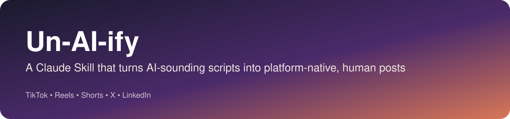

# Un-AI-ify

**Transform AI-generated social content into authentic, platform-native posts.**

## The problem

Most AI-generated social content sounds the same: uniform sentence length,
hedging language, "unlock"/"revolutionize"/"testament to," a hook that
doesn't hook, and zero specificity. It reads like it was written for no one
in particular — because it usually was.

Un-AI-ify is a [Claude Skill](https://github.com/anthropics/skills) that
takes that draft, diagnoses exactly which patterns are making it generic, and
rebuilds it around a real hook-hold-payoff structure — tuned to the actual
retention mechanics of the platform it's going to, not just "sound more
human."

## What makes this different

This is **not** an AI-detector-evasion tool. Detectors change constantly and
have high false-positive rates on non-native English and technical writing —
building around beating them is a losing, dishonest game.

Un-AI-ify is psychology-first: it applies research on curiosity gaps
(Loewenstein), the Zeigarnik effect, emotional arousal and sharing (STEPPS),
and platform-specific retention data (TikTok's 3-second gate, LinkedIn's 85%
muted-viewing rate, etc.) to make content that's genuinely more compelling —
and it refuses to fabricate stats, credentials, or experiences to get there.
See [`GUARDRAILS`](./SKILL.md#guardrails).
